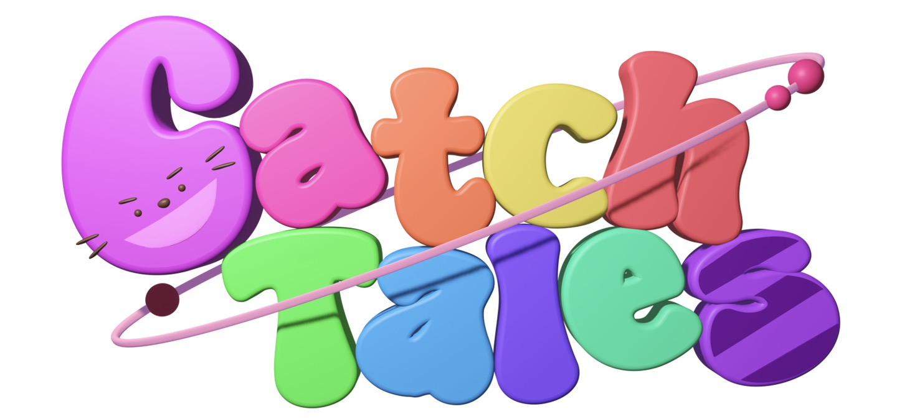
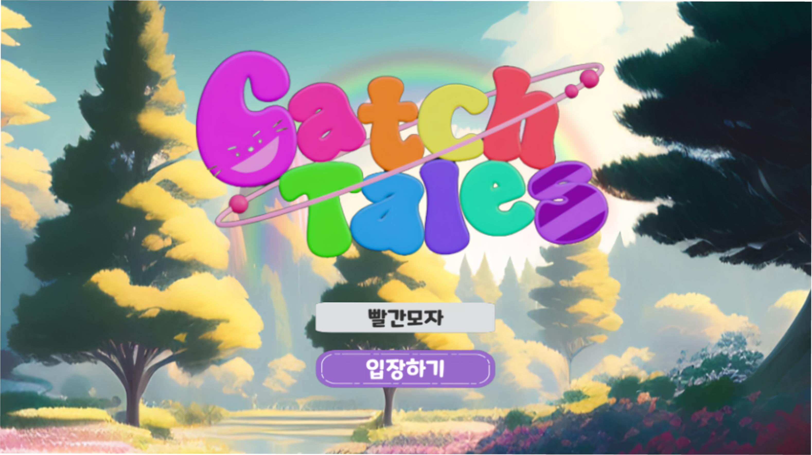
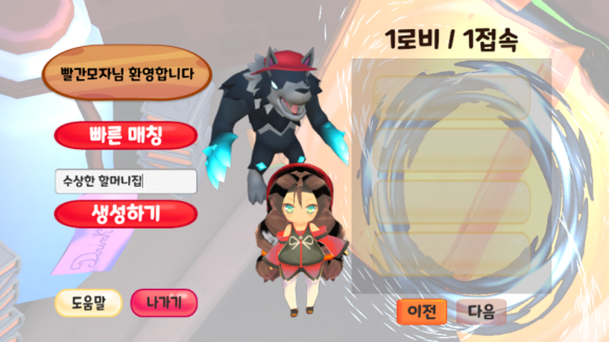
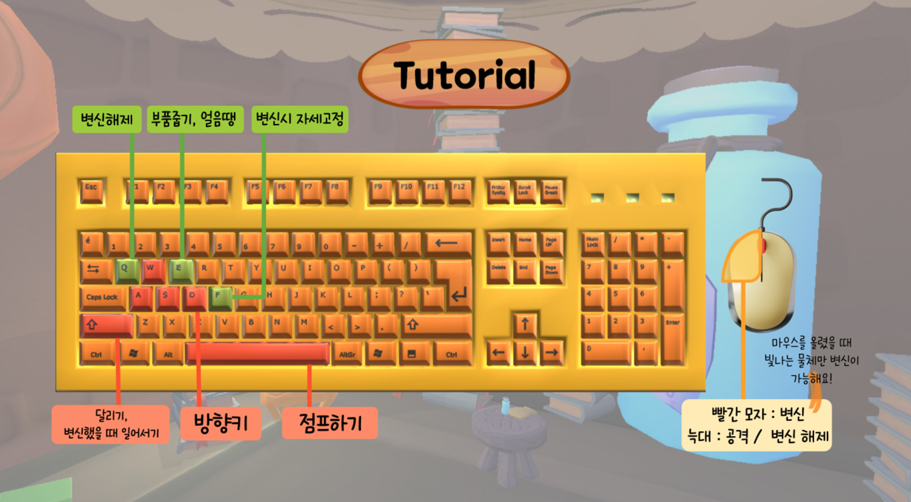
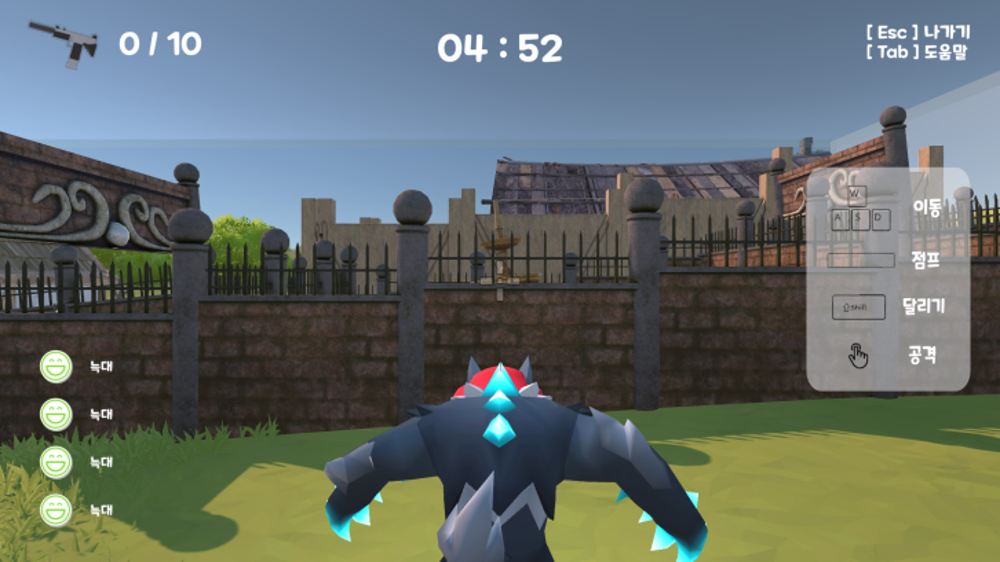
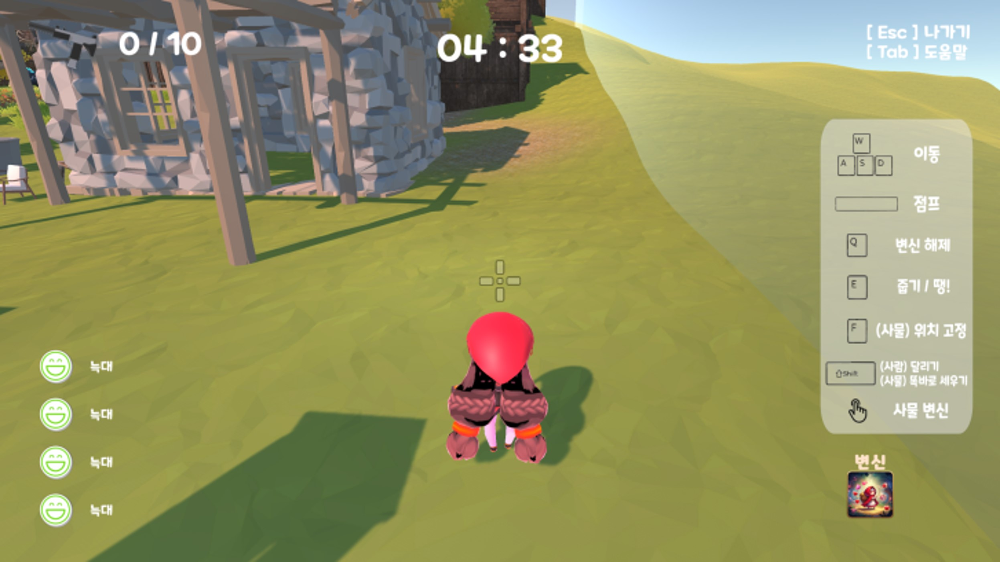
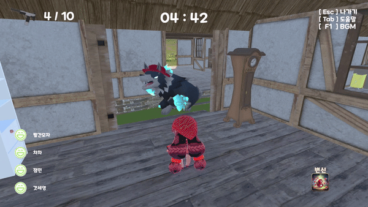

# CatchTales



## 🏷 프로젝트 소개

| 프로젝트 명 | CatchTales|
|---|---|
| 프로젝트 진행 기간 | 23.08.14(월) ~ 23.10.06(금)|
|🏆 **수상** | **우수상 2등**|
<br/>


## 🛸 다운로드 링크
[CatchTales 발표 자료 다운로드 링크](https://drive.google.com/file/d/1iVGUUF6JA7gK2LHvNPs8h-ZVb2OTsd5q/view?usp=drive_link)

[CatchTales 게임 다운로드 설치 링크](https://drive.google.com/file/d/1RipQYNKO0AaYgZCMMg01HSavgUlbLJUr/view)

## ✨ 기획의도


* "게임은 재미있어야 한다."
* 아이들을 위해 동화의 이야기를 차용
* 검증된 게임 장르인 사물 술래잡기를 채택

<br/>


## 🎬 프로젝트 UCC 및 시연영상
[CatchTales UCC](https://www.youtube.com/watch?v=BVZBZWkU-48)
<br/>
[CatchTales 시연 영상](https://www.youtube.com/watch?v=oBLyQdL7Xeo)
<br/>

## 🎮 게임 설명
### 입장하기


```게임 닉네임을 입력하고 입장하기를 누릅니다.```

###  방 만들러가기 


```돌아가고 있는 소용돌이로 뛰어 들면 로비로 이동하게 됩니다.```

### 로비


``` 만들어져 있는 방에 입장하거나 새로운 방을 만들 수 있습니다.```

### Tutorail 소개



### 인트로


``` 게임을 시작하기 전 인트로를 볼 수 있습니다.```

### 캐릭터 선택


``` 빨간 모자와 늑대 중 캐릭터를 선택할 수 있습니다.```

### 게임 시작


```서로 다른 랜덤 위치에서 게임이 시작됩니다. ```

#### Tab 키
|
---|---|

``` Tab을 누르면 조작키를 볼 수 있습니다.```

#### 총파츠 모으기


```빛나고 있는 곳에 가면 총파츠가 있습니다. 빨간 모자가 10개를 모으면 승리합니다.```


#### 빨간모자 얼음


```늑대가 빨간모자를 얼리고 30초가 지나기 전에 팀원이 구해지지 않는다면 죽습니다. ```

#### 같은 팀 구하기


```얼어있는 팀원에게 다가가 얼음을 깨줍니다.```
#### 빨간모자 승리


``` 총파츠를 10개 다 모으면 빨간 모자가 승리합니다. 다 모으지 못한다면 늑대가 승리합니다. ```

### 엔딩


``` 승리한 캐릭터에 따라 다른 엔딩이 나옵니다. ```

## 🔥 기술 스택

- Unity
- Photon
- Blender

<br/>

## 🙆‍♀️ 협업툴

- Git
- Notion
- Jira
- MatterMost
- Google Drive

<br/>


<br/>

## 🗂 설치 폴더 구조

```
📦CatchTales
 ┣ 📂CatchTales_Data
 ┣ 📂Managed
 ┃ ┣ 📂Resources
 ┃ ┗ 📂StreamingAssets
 ┣ 📂MonoBleedingEdge
 ┃ ┣ 📂EmbedRuntime
 ┃ ┗ 📂etc
 ┃   ┗ 📂mono
 ┃     ┣ 📂2.0
 ┃     ┃ ┗ 📜Browsers
 ┃     ┣ 📂4.0
 ┃     ┃ ┗ 📜Browsers
 ┃     ┣ 📂4.5
 ┃     ┃ ┗ 📜Browsers
 ┃     ┗ 📜mconfig   
 ┣📜CatchTales.exe
 ┣📜unins000.dat
 ┣📜unins000.exe
 ┣📜UnityCrashHandler64.exe
 ┗📜UnityPlayer.dll
```

<br/>

## 😎 팀원 

| 이름     | 역할                                    |
| -------- | --------------------------------------- |
| 권선근   | 멀티 환경 구축 & 캐릭터 스크립트 작성   |
| 김남우 👑 | 맵 디자인 & 스크립트 작성               |
| 김창혁   | 맵 디자인 & 스크립트 작성               |
| 박소윤   | 맵/로고/Tutorial 디자인 & 스크립트 작성               |
| 신세영   | 맵/캐릭터 디자인 & 스크립트 작성        |
| 최동우   | 캐릭터 간 상호작용 구현 & 스크립트 작성 |

<br/>
